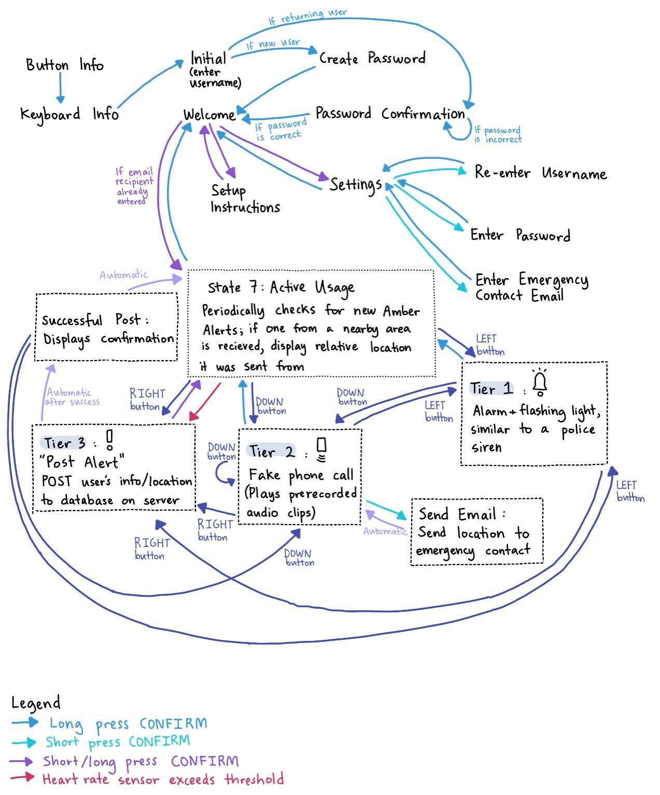

**Stranger Danger! Safety System**

Project Overview
===============================================================================
As female students who often walk alone at night, we were interested in implementing a 
multi-functional safety device with various levels of safety protocols programmed in place. 
Our project would consist of a three-tier response protocol that aims to deter assailants, 
communicate with emergency contacts, and alert nearby users.

Our first tier of response protocol will be a loud buzzer, which imitates the sound of a police siren, 
and a bright LED light that alternates between red and blue. This feature attracts the attention of 
nearby passerbys, informing them of a dangerous situation, allowing them to notify authorities in a timely manner, 
consequently making the user a more difficult target.

Our second tier of response protocol will be a pre-recorded phone call. The phone call makes attackers 
believe that there is someone expecting the user. If the user presses a designated button during this tier, 
an email will be sent to any pre-specified recipient, which could be an emergency contact like a family member 
or a close friend.

Our third and final tier is an AMBER alert system that informs all nearby online users of the danger by 
showing the location of all attacks at a given point in time on all nearby users’ screens. This will allow 
those nearby to either come to the aid of the distressed user to deter any danger or contact authorities regarding 
the threat.

With these three tiers of security, we hope that users can feel safer when walking alone at night, and our 
project would be able to provide a meaningful support system in the form of both preventative as well as 
responsive measures.

Video Demonstration
-------------------------------------------------------------------------------

Hardware Documentation
===============================================================================

Parts List
-------------------------------------------------------------------------------

* ESP32
* LCD
* Buttons
* Buzzer
* LED
* MP3 player
* GPS
* Heart rate sensor
    - [Amazon Link](https://www.amazon.com/MAX30102-Detection-Concentration-Arduino-Ultra-Low/dp/B07V5LF5BP)
    - Price: $3.25 
* Velcro straps 
    - [Amazon Link](https://www.amazon.com/VELCRO-ONE-WRAP-Organization-Management-Organizing/dp/B001E1Y5O6/ref=sr_1_1_sspa?crid=KY0T1SUOWMS5&keywords=velcro%2Bcable%2Bties&qid=1652050244&sprefix=velcro%2Bcable%2Bties%2Caps%2C129&sr=8-1-spons&spLa=ZW5jcnlwdGVkUXVhbGlmaWVyPUFEVVI5RjZTMUpMVlomZW5jcnlwdGVkSWQ9QTAwMTAzOTQzT0NKRTFYNldFN1FZJmVuY3J5cHRlZEFkSWQ9QTAxMzQ4MDhWMjFUT1NRVk1UN1kmd2lkZ2V0TmFtZT1zcF9hdGYmYWN0aW9uPWNsaWNrUmVkaXJlY3QmZG9Ob3RMb2dDbGljaz10cnVl&th=1)
    - Price: $11.40

System Block Diagram
-------------------------------------------------------------------------------

Wiring Setup 
-------------------------------------------------------------------------------

Code Documentation
===============================================================================

State Machine Diagram
-------------------------------------------------------------------------------

ESP32 Code
-------------------------------------------------------------------------------
### Button Class 

To simplify the code required for checking each button, we created a Button class that would read in the value from the Button and return 
either 0, 1, or 2 depending on if the button has not yet had a finished press, experienced a short press, or experienced a long press 
respectively. The Button class accounts for debouncing as well. 

### Device State Machine

The main state machine is composed of the sixteen states shown above. 

The first two states, BUTTON_INFO and KEYBOARD_INFO,
display preliminary instructions for the user, such as which button corresponds to the left button, down button, right button, or
confirm button. These states also specify how to move the selection arrow around for the keyboard, as well as how the user can 
indicate that they are finished entering what is being asked of them by long pressing the confirm button.

The INITIAL state prompts users to enter their username, which is checked against the database to determine if the user is a new 
user or a returning user.

If the user is a new user, they are brought to the CREATE_PASSWORD state to create a password for their new account. If the user is a 
returning user, they are brought to the PASSWORD_CONFIRMATION state to enter the password for their account. If they 
have not entered the correct password, the screen refreshes, prompting them to enter their password again. 

Both password-related states transition to the WELCOME state, which displays the username as well as multiple selections to
choose from. 

One selection is the SETUP_INSTRUCTIONS state. When entering this state, the pages of instructions are displayed one at a time, allowing
users to move to the next page by pressing the down button. Users can return to the WELCOME state at any time from this state. 

Another selection is the SETTINGS state. This leads to the following selections: the REENTER_USERNAME state, the ENTER_PASSWORD state, and the 
ENTER_EMAIL state, which all use the keyboard to allow the user to, respectively, change their username, their password, or their email 
recipient. After the user confirms that they have finished entering their information, we send up any changes that they have made to a Python 
file on the server, which is responsible for updating these changes in the user information database. Then, we return to the SETTINGS state, 
which can be used to return to the WELCOME state. 

The final selection allows the user to start using the device's functionality, bring the user to the ACTIVE_USE state. If the user has not
yet set up their email recipient, they will remain in the WELCOME state and be prompted to look at the setup instructions and set up their 
device accordingly. Inside the ACTIVE_USE state, users see a radar-like display, with their location in the center of the circle, represented
by an X, and the locations of other nearby users that are currently in danger, represented by a red dot. From the ACTIVE_USE state, users can 
go to any of the three other tiers. Users can also choose to log off from the device by long pressing the confirm button and returning to the 
WELCOME state. Inside the ACTIVE_USE state, the TIER_1 state, the TIER_2 state, and the SUCCESSFUL_POST staate, users can reach each of the 
other tiers conveniently via a button press. 

The state responsible for the first tier is the TIER_1 state. Inside this state, we use timers to keep track of when the LED should be
switched from blue to red or red to blue, imitating police lights. We use another timer to keep track of the siren as well. This siren is 
implemented by playing decreasing frequencies for two seconds, and then playing increasing frequencies for another two seconds before the 
cycle resets. 

The state responsible for the second tier is the TIER_2 state. Each time, when we enter this state after previously having been in a 
different state, we play an audio determined by the global variable audio_to_play. When the user presses the down button, based on the 
script that we have written for the fake phonce call, we determine what audio to play next, storing this result in audio_to_play. The 
script can be split into three sections: one section is a basic conversation, where the audio asks the user about their day and talks about
events that happened to them as well; the second section is a collection of generic responses, such as "Oh, really?" or "Oh, wow!", allowing
the user to speak to fill the time; and the third section is the specific audio played if the user wishes to send their location through
email to their emergency contact. If we are still in the first basic script section, when choosing audio_to_play, we simply progress to 
the next recorded audio in the script. If all of the long stories in this section have been exhausted, we move on to the second section of
the recorded audios. If we are in the second section, we use the current time, in milliseconds, as a random number generator to select which 
of the generic responses to play. If we have just played the special response after the user has sent their location to an emergency contact, 
we begin to play the long stories again. As a result, audio_to_play is mostly modified within the TIER_2 state. However, there is one special 
case if the user indicates that they want to sned their current location to their emergency contact by pressing the confirm button briefly, 
prompting the system to move to the SEND_EMAIL state. 

In the SEND_EMAIL state, we generate the POST request to the Python file on the server that sends an email to the user's specified 
emergency contact. We set audio_to_play to the audio created specifically for this action, which asks the user where they are and states that 
the person on the other end of the phone call is heading out to find them, possibly deterring attackers by making it seem as if the user will 
be able to meet someone soon. This state then automatically returns to the TIER_2 state, which then plays the specified audio. 

The third tier is encapsulated using two states, the POST_ALERT state and the SUCCESSFUL_POST state. Inside the POST_ALERT state, we 
continuously attempt to call a function that reads in the user's current location from the GPS and generates a POST request to the server, 
so that the Python file on the server can include the user's information in the AMBER alert database. If the information has been successfully 
posted to the server, we move to the SUCCESSFUL_POST state, which displays this information to the user briefly before returning to the 
ACTIVE_USE state. If the information could not be posted successfully, we keep trying, staying in the POST_ALERT state. In case the GPS is 
continuously unable to find a signal, the user can also terminate these attempts via a button press, manually returning to the ACTIVE_USE state
to use the other tiers' functionalities. 

### GPS Functions 

To extract the proper data from the GPS, we had to parse the information that the GPS sent in to determine what parts were relevant and what 
parts were not. The proper data that we needed had two markers that indicated whether or not the data that we needed was provided. First, it 
was that "GNRMC" had to be present in the string. Second, "V" could not be in the string. If these two conditions were satisfied, then we would 
have a valid GPS reading. The location data that we were looking for would be between the third and seventh commas in the data, so we 
extracted this information into a global variable, lat_lon. This data would then be sent up to the server to carry out the proper unit 
conversions, as the data provided by the GPS was in DMS - degree minutes and seconds - form, rather than the standard form that we are 
used to seeing. All of this was carried out by the extractGNRMC() function, which also printed the user's location in DMS form on the ESP32. 
Afterward sending up the user's data to the server, we would receive a list of nearby users within a 0.25 mile radius to be plotted on the 
screen as well. 

### Heart Rate Sensor Functions

The heart rate sensor was unique in that, regardless of the state that the device was in, the heart rate sensor should continue to take 
data measurements to keep its average value as accurate and up-to-date as possible. Thus, the code for getting the data from the heart rate 
sensor was placed before the switch-case statement for the overall state machine. 

To ensure accurate average measurements, we kept track of the last 50 heart rate measurements and used this data to calculate the average. 
This was not a weighted average, so each data measurement held the same weight in determining the average heart rate. 

Through our testing, we also determined that calibration was needed for the heart rate sensor to function probably. Thus, we set this 
calibration to be 10000 measurements, ensuring that the heart rate sensor had ample time to warm up and take better measurements. It is only
after this that we set the threshold for determining whether or not the user's heart rate is higher than normal.

The functionality for determining when to escalate from the ACTIVE_USE state to the POST_ALERT state is accounted for by another state 
machine. This state machine has two states, HEART_IDLE and HEART_PEAK. The state machine behavior is in the function heartrate_activation_fsm(). 
For the HEART_IDLE state, it transitions to the HEART_PEAK state when the user's heart rate is above the given threshold. In the HEART_PEAK 
state, if, at any point, the user's heart rate falls below the threshold, we return to the HEART_IDLE state. If the user's heart rate has 
remained consistently high for more than three seconds, we return to the HEART_IDLE state, and the function returns 1 instead of 0. This is 
important for the ACTIVE_USE state, since, if the function returns 1, then we directly transition to the POST_ALERT state. To prevent the 
heart rate sensor from constantly triggering the AMBER alert sending, we also use a timer, heart_post_timer, to see if it has been four 
minutes since the last AMBER alert posting done by the heart rate sensor in order for us to transition to the POST_ALERT state from the 
ACTIVE_USE state. Note that, although heart rate measurements are taken in all states, we only act upon the value returned by 
heartrate_activation_fsm() if the user is currently in the ACTIVE_USE state. 

### Keyboard Functions

The keyboard functionality, used in many of the initial states, relies on two main functions: display_keyboard() and enter_letters(). The 
first function prints out all 49 letters used in the keyboard and stores the locations, in pixels, of where the selection arrow should be 
when a given letter is selected in a global array named letter_arrow_positions. 

enter_letters() is responsible for the main capability of allowing the user to move around the selection arrow and enter the letters that 
they wish to enter. This function takes in the values of the button presses as input and keeps track of the previously selected letter 
as well as the currently selected letter. Upon entering the function, it first checks is there is a discrepancy between the previously 
selected letter and the currently selected letter. If there is, the function erases the selection arrow at the previous location and 
draws a new one at the new location, so that the display on the ESP32 matches the choices that the user has made. Depending on the button 
presses, this function also updates the currently selected letter. A press on the right button means that we are selecting the letter to the 
right of the currently selected letter, a press on the left button means to move the selection to the left by 1, and a press on the down 
button means to move the selection down by 1. In case this results in moving out of bounds, we wrap around. For example, trying to move right 
from the rightmost character results in the arrow moving to the leftmost letter in the same row. A short press on the confirm button means 
that the user wants to add the currently selected letter to the string they are entering. If the letter they selected was the backspace key, 
we delete the last letter from the string that they are currently entering and reprint the string. If the letter they selected was the shift 
key, we set a boolean variable called capitalize to true, indicating that the next letter entered should be capitalized. For all other cases,
we append the properly capitalized, selected letter to the string they are currently entering and reprint the string on the ESP32.  

Server Code 
-------------------------------------------------------------------------------

### amberalert/amber_alert_system.py

To handle Tier 3 for a user currently in danger, in our embedded side code the extractGRNMC() function is called. That function calls extract() to get the user’s location from the GPS in DMS format, 
and then the user’s username and location are POSTed to the server side request_handler function. In request_handler, we first call parse_latlon to extract the 
decimal value of the user’s latitude and longitude. If the given username is not already in the Amber Alert database, a new entry with that 
username, latitude, longitude and timestamp is inserted. Else, the old entry for that user is deleted and a new entry with the updated location for that user 
is inserted into the Amber Alert database.

In the active use state, we also repeatedly call extractGRNMC(), which calls extract() to parse the GPS location data and then makes a GET request containing those 
coordinates to a server side request_handler function every 30 seconds.

In the server side request_handler function, to handle GET requests containing the user’s current location, we first call parse_latlon 
to extract the decimal value of the user’s latitude and longitude. Then, we loop through each current entry in the AMBER Alert database. 
For each entry, we use helper functions find_distance and find_bearing that implement the Haversine formula to calculate the distance in 
miles and bearing angle between the user’s location and the POSTed location in the database. If the distance was less than a quarter of a mile, 
we calculate a scaled value of that entry’s location coordinates to fit in a 100 px by 100 px display on the LCD (so 0.005 mile corresponded 
to 1 pixel). We concatenate all the desired coordinates into a string with commas in between and return the string. 

To calculate the distance between two points and where to plot the user in danger, we carry out the following steps using the formulas mentioned
above: 

1. Convert the DMS coordinates to normal latitude/longitude degrees. Latitude/longitude coordinates in DMS form have the format of 4221.4597N07105.6100W.
    - For the latitude, we take the first - leftmost - two numbers before the decimal. We add this to the remaining numbers of the latitude, starting from the third number and ending before the N/S character, divided by 60.
    - For the longitude, we take the leftmost three numbers before the decimal. We add this to the reamining numbers of the latitude divided by 60. 
2. Find the distance between two sets of latitude and longitude values. Let one user be represented by $(lat_a, lon_a)$, and the second user be represented by $(lat_b, lon_b)$. 
    - Multiply all values by $\frac{\pi}{180}$. For example, $lat_a = lat_a \cdot \frac{\pi}{180}$. 
    - Apply the Haversine formula.
        - $adj\_lon = lon_b - lon_a$ 
        - $adj\_lat = lat_b - lat_a$ 
        - $a = \sin^2(\frac{adj\_lat}{2}) + (\cos(lat_a) \cdot \cos(lat_b) \cdot \sin^2(\frac{adj\_lon}{2}))$
        - $val = 2 \cdot \arcsin(\sqrt{a})$
    - Get the distance in terms of miles. 
        - $dist = val \cdot 3956$
3. Find the angle between $(lat_a, lon_a)$ and $(lat_b, lon_b)$.
    - Multiply all values by $\frac{\pi}{180}$. For example, $lat_a = lat_a \cdot \frac{\pi}{180}$. 
    - Calculate the bearing between the two values. 
        - $x = \cos(lat_b) \cdot \sin(adj\_lon)$
        - $y = (\cos(lat_a) \cdot \sin(lat_b)) - (\sin(lat_a) \cdot \cos(lat_b) \cdot \cos(adj\_lon))$
        - $bearing = \frac{180}{\pi} \cdot numpy.arctan2(x, y)$
4. Scale the points to be plotted on the LCD connected to the ESP32. 
    - $angle = 90 - bearing$ 
    - $x_{point} = 200 \cdot distance \cdot \cos(angle)$
    - $y_{point} = 200 \cdot distance \cdot \sin(angle)$
        - Depending on which direction the endangered user is compared to the current user, we may negate these values.
    - $x_{plotted} = 64 + x_{point}$ 
    - $y_{plotted} = 64 - y_{point}$
5. We do this for each user that is within 0.25 miles of the user who is querying, and we return a list of the $x_{plotted}$ and $y_{plotted}$ values. 

Back in the embedded side, during the active use state, the returned string of points to plot is parsed to retrieve the appropriate coordinates. On the LCD, the user’s current location 
in DMS (degree minute second) format is printed, and inside the circular figure a red point is displayed at each respective coordinate for each nearby 
user (that is not the current user) in danger within a quarter mile radius.

### amberalert/amber_alert_remove.py

When a user sends a POST request to indicate that they are out of danger, the user’s information is removed from the database simply by 
removing the entire row of information corresponding to their unique username. Again, the updated and formatted database of information 
displaying all currently endangered users is returned as a result of the request.

### amberalert/amberalert.db 

This is the database that we use to store the information of the user's who are currently in danger. The information stored includes 
the user's username and their location. This database can be modified by both the amber_alert_system.py and the amber_alert_remove.py 
files. 

### userinfo/server_secure.py

**Handling Tier 2**

If a POST request is received with an ‘action’ key set to ‘send_email’ (along with a username and a location), the request_handler Python 
function will search the user information database to find the entry for the given username. Using a SMTP client session object, it will 
attempt to email a notification message containing the user’s most recent location to the user’s emergency contact. If this is successful, 
a success message is returned. Else, an error message is returned. 

**Creating and Updating Accounts** 

The user information database contains 4 columns: username, password, preferred name, and emergency contact email.

If a POST request is received with account=create, the request_handler function first will check all usernames in the database so far. 
If the given username already exists, an error message will be displayed. Otherwise, a new entry in the database will be made, and the new 
user’s username and password will be inserted along with the other parameters set to a default blank string. 

If a POST request is received with account=update, the request_handler function will try to find the entry in the database for the 
given username. If this is unsuccessful, or if the given password does not match the user’s password, an error message is displayed. 
Else, for each parameter, if its value in the request dictionary is not a blank string, the old value in the database is updated. 
A success message will be returned.

**User Authentication**

To implement user authentication when logging in from the ESP32, there are two possibilities that we need to consider. The user can be 
a returning user, or they are a new user who needs to create a new account. This can be verified by checking if the username they have 
entered exists in our database. To check this condition, the ESP32 sends a GET request to the server specifying that we are looking to see 
if the username already exists in the database, and the server returns a string containing either “true” or “false”. If the user does exist, 
we proceed to the PASSWORD_CONFIRMATION state, or, if they do not exist, we proceed to the CREATE_PASSWORD state.

In the PASSWORD_CONFIRMATION state, after the user finishes entering in their password, indicated by a long confirmation button press, 
the ESP32 sends another GET request to the server, checking to see if the password entered matches the one we have stored in the database. 
If it does, we allow the user to login and start using the device. We also get all the information that they have stored in the database, 
such as email recipient, updating this information on the ESP32 so that they do not have to re-enter their preferences. If the password 
they entered was deemed to be incorrect after checking with the database, we stay in this state and prompt them to enter their password again. 

In the CREATE_PASSWORD state, after the user has finished entering their password, we POST their username and password to the server 
to create a new account for them. 

Inside each of the states where the user can change their preferences, such as email recipient, email body, keyword, and password, 
after the user has finished their changes, we update their preferences in the database on the server as well through a POST request. 

Inside of the database, passwords are encrypted using a Vigenere cipher. This Vigenere cipher specifically uses the username as 
the key to encrypt/decrypt passwords, returning the encrypted/decrypted message based on the provided username and the value of the boolean 
variable ‘decrypt’. The function begins by creating a keyword based on the username by repeating the password to match the length of the 
username. If the decrypt variable is False, the function encrypts the password by shifting each character in the password string by the 
corresponding character in the keyword string; the shift is calculated by taking the ASCII code of a given character in the keyword string 
and subtracting 32. Similarly, if the decrypt variable is True, the function decrypts the encrypted password by reverse shifting each 
character in the encrypted password string by the corresponding character in the keyword string.

### userinfo/settings.db 

This is the database that we use to store all user's information. This contains relevant information about the user's account, such as their 
username, name if specified, password encrypted using a Vigenere cipher, and email recipient.  

### Location Tracker and HTML Form 

The webpage can be accessed by running “python safety_app.py” (safety_app is located in the “Online” folder in the main project directory) 
as well as “node tracker.js” (tracker.js is located under the “Templates” folder under “Online”) and then using 
http://localhost:5000/location.

**HTML Form**

To complement the account creation capabilities of the device, we also used Flask to create an online HTML form system that allows users 
to efficiently make an account or update their user info. The create account tab lets users choose a desired username and password, 
and the update info tab lets users enter the other parameters. Upon pressing the submit button, a POST request is sent to the 608dev-2 
server so the user info database can be updated. 

**Location Tracker**

Because the Tier 3 display on the LCD is relatively limited, we also added a “location tracker” tab that is linked to the account setup 
form. It allows a user to enter their username and current location and makes a GET request to our server side request_handler function to 
retrieve the coordinates of nearby users from our amber alert database. Afterward, it redirects to a new page that uses the Google Maps 
JavaScript API to display an interactive map with markers at the exact coordinates of nearby users currently in danger (which correspond 
to the red points on the LCD display). 

Technical Challenges and Design Decisions
===============================================================================

Technical Challenges
-------------------------------------------------------------------------------

Integrating the various parts together proved to be a significant challenge. The MP3 player and the GPS both used RX/TX connections, 
which required testing out different pins and code to make sure that neither interfered with the other and that signals to and from 
the both of them would not be mixed up. Initially, both the MP3 player and the GPS, since these parts were implemented by two different 
people, utilized the pins 17 and 18. While integrating these parts together, we found that it was necessary to move the GPS to pins 11 and 
12. Even after making these changes, the two components seemed to interfere with each other, as the ESP32 became unable to locate or connect 
to the MP3 player. So, we changed the code for the MP3 player as well, changing it from HardwareSerial to SoftwareSerial, which required 
downloading the EspSoftwareSerial library. After these changes were made, we were able to successfully use both components at the same 
time.  

Another technical challenge lay in working with the MP3 player. When inputting the recorded audios onto the microSD card, it was uncertain 
which order that they would appear in. Through trial-and-error, we determined that this order relied on the order that we dragged the audios 
onto the microSD. So, to make the code cleaner, we dragged the audios on in reverse order, so for most audios, each time, we could simply
decrement audio_to_play by 1. 

Design Choices 
-------------------------------------------------------------------------------

One of the design choices that we made early on in the project was the usage of button presses to get from one tier to another while in 
the ACTIVE_USE state, as well as each tier's accessibility from each other tier, instead of the selection system used in the WELCOME and 
SETTINGS states. This is because we wanted to make each tier easily and quickly accessible. In each of the tiers, the same button corresponded 
to the same tier - whether the user was in TIER_1 or TIER_2, pressing the right button would directly bring them to the POST_ALERT state. We 
believe that this consistency and ease of access is necessary to ensure that users can quickly get the help that they need. 

Other design choices revolved around our design of the AMBER alert system. We decided that only users in the ACTIVE_USE state should be 
notified of AMBER alert posts, as we did not want to distract users who already felt unsafe. As a result, we decided that, while in the 
ACTIVE_USE state, the ESP32 would automatically check with the server every 30 seconds to update, if needed, the list of nearby users who 
are in danger and should be displayed on the user's device. This check also takes into account the change of position of the user themselves, 
as the people who are nearby may change depending on where the user currently is. We decided 30 seconds as the time between checks since this 
was infrequent enough to prevent interference if the user wanted to switch to another tier, but it was also frequent enough to take into 
account changes in the user's position or the status of people around them who required help. Another choice we made in implementing the 
AMBER alert system lay in what the response should be in cases where the GPS cannot receive any signal. For the display in the ACTIVE_USE 
state, if the GPS cannot get any signal, we display to the user that their location is still loading. If the user wishes to post to the 
AMBER alert database, this posting is only possible if we can get data from the GPS. So, when we post to the AMBER alert database, we do not 
just attempt to post once before returning to the ACTIVE_USE state. Rather, we continue to attempt to post until the post goes through. 
However, in cases where the user is unable to get signal for a long period of time, this would be a detriment to the user's safety, as they 
would be unable to access the other tiers that might be able to deter the attackers. Because of this, we also added a manual termination to 
this process. If the user presses the confirm button, they return to the ACTIVE_USE state without having posted to the AMBER alert, and are
able to use the other features well. 

One major design choice we made was regarding the second tier. Initially, we wanted to use Google's Speech-to-Text API so that, when the 
user says a designated keyword, the email send is triggered. However, after implementing this in the second week, we discovered that this 
did not serve its purpose well, as the time that the Google API takes to process what was said makes the phone call seem unrealistic. 
Additionally, getting the ESP32 to record the audio required button presses as well, so it was more complicated for the user too, since they 
had to press the button to get the ESP32 to start recording and press it once more to get it to send the audio up to the Google Speech-to-Text 
API. Thus, to simplify the process and prevent the unrealistic waiting times from happening, we simply allow the user to move on to the next 
audio with a button press and send their location via email to their emergency contact by pressing the confirm button. 

Weekly Deliverables
===============================================================================

Week 1
-------------------------------------------------------------------------------
**Set up state machine skeleton, although majority of the states will be placeholder states without their full functionality.**

Demonstrate going from the start up state to the setup instructions, settings, and active use state; from the active use state, 
go to each of the three tiers and back, and show logging off - returning to the start screen - as well. 

**Create the Python function for sending emails (to the emergency contact stored in the user info database) upon POST request.**

Make a request through Postman and show the received email in our inbox with a hardcoded message.

**Set up the database for storing user information and create an HTML form that also allows users to submit/update their preferences and adds it to the database.**

Demonstrate the ESP32 sending a POST request to a Python file containing the user's username, email recipient, email body, and keyword when we first enter the active usage state; if the username is already in the database, we want to replace the current info we have on the user with the new info; also show entering the information into the HTML form and then printing the results of the database afterwards.

**Create a functioning "keyboard" display for the LCD that allows the user to enter in their information on the ESP32.**

Show the user entering in all of their information - username, email recipient, email body, keyword - before sending the information up to the database.

**Be able to flash the LED light on the device as is necessary for the first tier of the alarm response.**

Complete the first tier system with siren and flashing lights. Demonstrate the flashing of the LED in the SOS Morse Code pattern – we will test both the LED on the ESP32 itself and the LED given in the Smart Lamp design exercise to determine which is brighter/better at attracting people’s attention.

**Find all necessary hardware components and their sellers.**

Upload the information to the spreadsheet so that we can get all of our needed parts. There is no video associated with this deliverable. 

**Create the AMBER alert-like database.**

Show posting to the AMBER alert database via Postman and, when doing a get request from it again via Postman, the database should have the information of the people who posted.

Week 2
-------------------------------------------------------------------------------

**Attach the heart rate sensor and implement the capability to automatically bring the user to the AMBER alert posting state from the active use state when the heart rate passes a certain threshold.**

Show the heart rate sensor measuring the user's heart rate and printing the heart rate values in the serial monitor, and, when the user's heart rate passes the specified threshold, the ESP32 now shows that it has moved to the AMBER alert state.

**Plan and record the audios necessary for simulating a phone call between two parties and upload these audios to the MP3 players.**

Using the MP3 player's speaker, play two of the recorded audios, and show which audios correspond to which spoken keywords. 

**Have the ESP32 record what the user is saying, and, through Google's text-to-speech API, retrieve the recorded message before playing the appropriate message response and sending an email to the specified recipient if needed.**

Switch to Tier 2 and show saying one or two of the keywords that will trigger specific audio responses, as well as the email sending keyword, and show the received email.

**For the AMBER alert system, make periodic GET requests when the user is in the active use state to get a list of people in danger, and process these results so that nearby users who are in danger will have their relative locations displayed on the ESP32.**

Show the current contents of the database, and show the radar-like display on the ESP32 when there is a nearby user who has had their information posted onto the AMBER alert database so that the position of the user is displayed in the center, with the user in distress being represented by a dot showing their relative position to the user.

**Allow for user authentication and a more secure logging in process so that we will be able to remember user information, such as email recipients and keywords, between each session of use of the device.**

Week 3
-------------------------------------------------------------------------------

**Integrate all tier responses, user login, heart rate sensor, GPS module, MP3 player, and buzzer into a working product.**

Demonstrate all of the tiers by switching from the active use state to each of the tiers and switching back.

**Create detailed setup instructions for the user so that they will be able to use the product upon first receiving it.**

On the ESP32, go from the welcome screen state to the setup instructions, and go through the pages one by one.

**Improve the visual displays inside the states TIER_1, TIER_2, RECORD_SPEECH, TEXT_TO_SPEECH, SENDING_EMAIL, POST_ALERT, and SUCCESSFUL_POST – these are all of the states used in the three tier responses – so that they accurately inform the user of the action currently being carried out.**

In these tiers, show what is displayed for each tier and that it gives a clear sense of the purpose of each tier as well.

**Improve the reliability of the heart rate sensor through software calibration during setup.**

Show the user's measured average heartbeat while inside the active use state.

**Provide the user with the functionality of changing their username after logging in.**

Show the user logging in and changing their username. Upon restarting the ESP32, they will be able to log in with the new username.

Week 4
-------------------------------------------------------------------------------

**Finish all documentation -- source code, code overview, and diagrams, and set up multiple working devices.**

Submit all final documentation to the shared Google Drive folder. There is no video deliverable for this part. 

Website Link: https://608dev-2.net/sandbox/sc/team63/finalreport/finalreport.md.html 

**Record and edit the final demonstration video for the completed product.**

Submit the video showcasing all tier capabilities as well as each part's capabilities and narrate what is happening. 

**Clean up the code for the ESP32 state machine and the code for the Python files on the server as well as the HTML form.**

Comment the code and remove any unnecessary parts, and submit the well-organized, documented code to the shared Google Drive folder. There is no video deliverable for this part. 

**Add an initial state informing users of how to use the keyboard and what the button presses correspond to.**

Show restarting the ESP and this initial state being the first page to show up, telling users the purposes of each button in using the keyboard to enter their username and password.

<video src='https://user-images.githubusercontent.com/95010893/181893891-ca147b16-544d-422b-99cb-d478549ab7e3.mp4' width=180/>

Team Members
===============================================================================

Sabrina Hu 
Kelly Lu 
Luisa Pan 
Ivy Wu 
Alice Zhao 

<!-- Markdeep: -->
